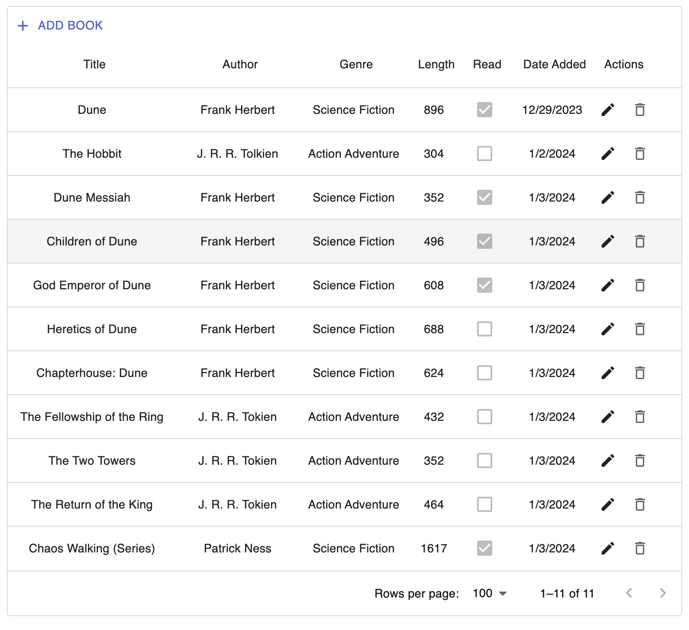

# books-to-read

# Steps to Run the Program Locally:

## 1. Download and Install Docker Desktop

## 2. Clone the repository and navigate to the root directory in your terminal

## 3. Execute the Shellscript file via the following command lines:

```bash
chmod +x entrypoint.sh
./entrypoint.sh
```

This will build and run the API and UI Docker images. **Note that if you are using Windows you must use Git Bash or another Unix-like terminal to execute `chmod`**.

# Picture Example of Front End


